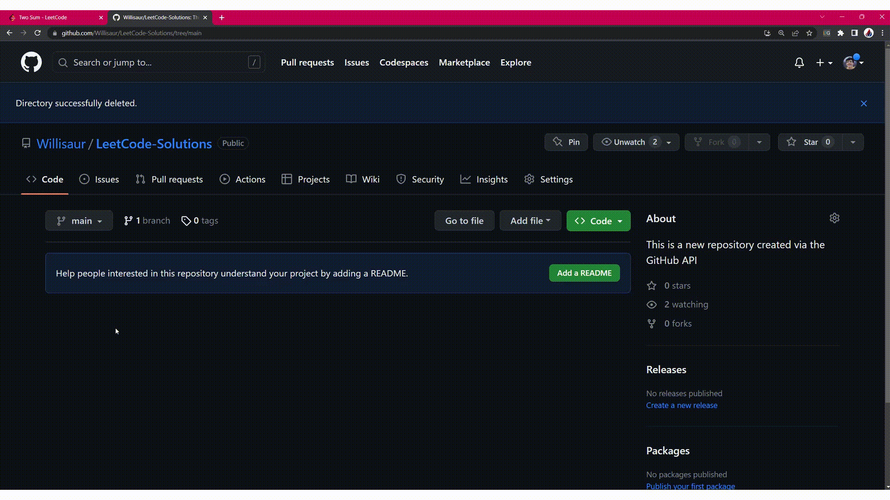

Download (Chrome Web Store): bit.ly/CWS-L2G

# LeetCode-to-GitHub
A Chrome extension that automatically uploads your LeetCode solutions to GitHub.

## Demo GIF

## About
This Chrome extension uses fetch requests and the Chrome extension API to automate uploading LeetCode solutions to your GitHub account.

### Auth token
A GitHub authentication token is required. This can be done by going to profile > settings > developer settings > personal access tokens > fine-grained tokens OR tokens (classic). It is recommended to ensure the token can be used to delete and create repos, see repo information, see commit/file information, and create/commit to files. This token is only stored in your Chrome account storage.

### Commit file structure
All LeetCode problems are separated by folders, and solutions are in each folder and separated by languages. To view submission statistics, look at the extended commit description.

## Thank you
I hope this helps you boost your coding portfolio and boast your dedication to mastering technical interviews! :%29
I'd love to hear about how this has helped you!
If it really helped you a lot, please consider donating to me on PayPal or connecting with me on LinkedIn/GitHub. Thank you!
